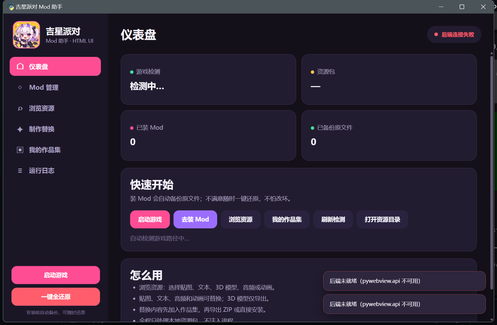
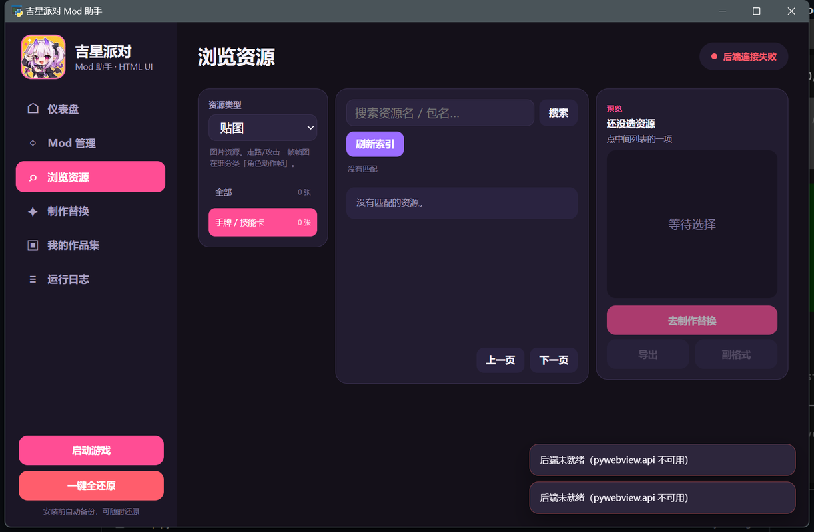
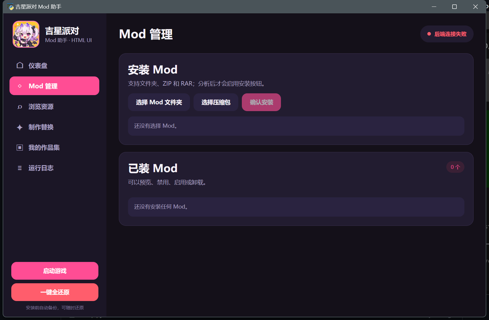
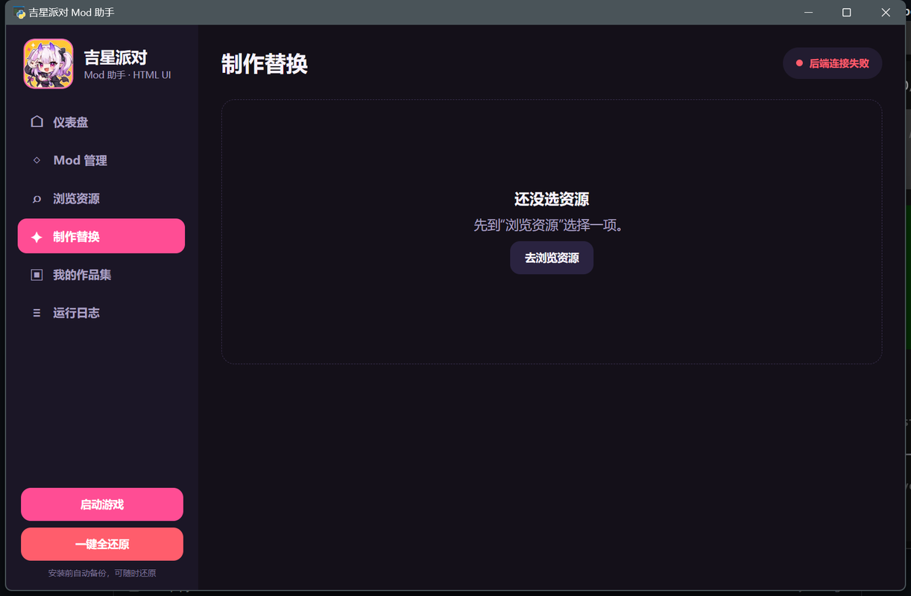
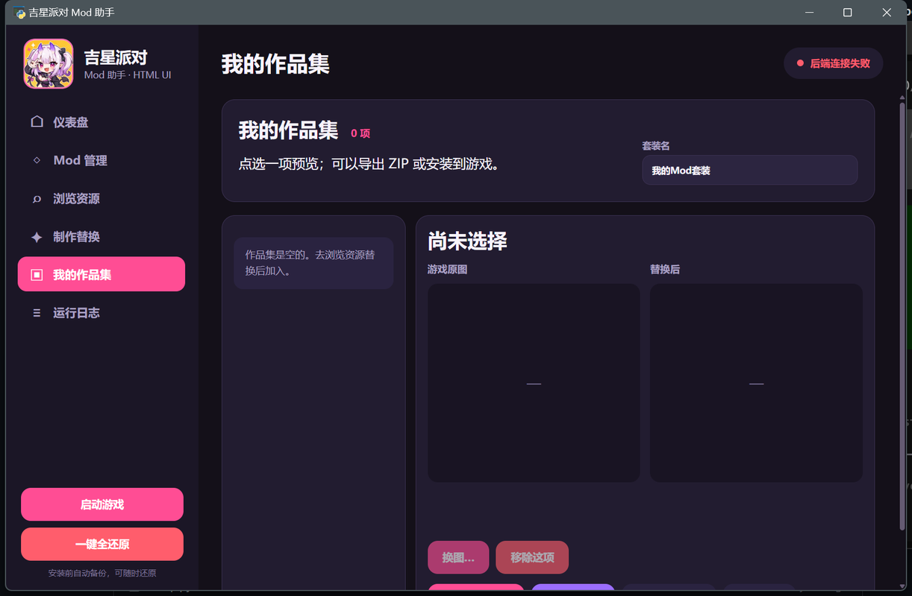

<p align="center">
  
</p>

<h1 align="center">吉星派对 Mod 助手</h1>

<p align="center">
  <b>Astral Party · Local Mod Helper</b><br>
  本地安装 / 预览 / 制作 / 还原 · 只动资源包，不注入进程
</p>

<p align="center">
  
  
  
  
</p>

---

给 Steam 版《**吉星派对 / Astral Party**》用的 **本地资源 Mod 工具**。  
可以装别人做好的换皮包，也可以自己浏览游戏资源、换图导出、打包分享。

> **安全边界（请先读）**  
> 本工具只替换游戏目录里 Addressable 的 `*.bundle` 本地文件，并自动备份原文件。  
> **不注入进程、不读内存、不改反篡改。**  
> 使用第三方资源与修改游戏文件均有风险，后果自负。

---

## ✨ 主要功能

| 功能 | 说明 |
|------|------|
| **装 Mod** | 文件夹 / `.zip` / `.rar`，自动匹配当前游戏版本资源包 |
| **备份还原** | 安装前自动备份；可禁用 / 启用 / 卸载单个，或一键全还原 |
| **浏览资源** | 贴图 · 文本 · 3D 模型 · 动画；贴图可再分「手牌 / 事件 / 筹码 / 格子…」 |
| **导出** | 贴图 PNG/JPG、文本、网格 OBJ、动画 JSON / 二进制 |
| **自己做** | 替换贴图 / 文本 / 动画 → 加入作品集 → 导出 ZIP 或直接装进游戏 |
| **界面** | 默认 HTML + pywebview（缩放顺畅）；可用 `--legacy` 回退旧 Tk 界面 |

<p align="center">
  
</p>

---

## 🚀 快速开始（只要 exe，不要 cmd）

### 环境要求

- **Windows 10 / 11**
- 已安装 Steam 版《吉星派对》
- **无需** 安装 Python、**无需** 点任何 `.cmd`

### 使用 exe

1. 下载/打开文件夹 **`JiXingModHelper`**  
2. 双击 **`JiXingModHelper.exe`**  
3. 备份、索引、作品集写在 **exe 同目录**（`modkit_data`、`made_mods`）  
4. **整夹拷贝**，不要只拷一个 exe  

路径示例：

```text
D:\AstralPartyAuto\dist\JiXingModHelper\JiXingModHelper.exe
```

### 开始用

1. 打开后看 **仪表盘** 是否「游戏已连接」  
2. **Mod 管理** → 选文件夹/压缩包 → 确认安装  
3. 或 **浏览资源** → 选资源 → **制作替换** → **我的作品集** 导出/安装  

### 开发者：从源码打包 exe

```powershell
cd 仓库根目录
powershell -ExecutionPolicy Bypass -File .\build_exe.ps1
```

产出：`dist\JiXingModHelper\JiXingModHelper.exe`（无黑窗）。

---

## 📖 使用步骤（图文）

### 1. 仪表盘：确认游戏已连接

启动后应显示「游戏已连接」、资源包数量等。  
若未检测到，请确认 Steam 已装游戏，再点 **刷新检测**。


### 2. 浏览资源：找贴图 / 动画等

1. 左侧下拉选择类型：**贴图 / 文本 / 3D 模型 / 动画**  
2. 贴图再点细分类（手牌、角色半身像、筹码、地图格子…）  
3. 中间点资源，右侧预览  
4. 可 **导出 PNG/JPG**，或 **去制作替换**



> **小提示**  
> - **筹码** 就是筹码（资源名里可能有 Relic，界面不叫遗物）  
> - 走路/攻击的一帧帧图：贴图 → **角色动作帧**  
> - 动画预览用同包第一帧/图集（如 `Walk-001`）  
> - 若文本/动画列表为空，点一次 **刷新索引**

### 3. 安装别人的 Mod



1. **Mod 管理** → 选 Mod 文件夹 或 ZIP/RAR  
2. 看清「可装 X 个 / 跳过 Y 个」  
3. **确认安装**（会自动备份原文件）  
4. 可随时 **禁用 / 启用 / 卸载**，或侧栏 **一键全还原**

### 4. 自己做替换 → 作品集



1. 浏览里选中资源 → **去制作替换**  
2. 贴图/动画：选图（可裁剪）；文本：直接改  
3. **确认替换并加入作品集**



4. **我的作品集** 里对比原图 / 新图  
5. **导出 ZIP 分享**，或 **安装到游戏**

| 类型 | 可替换 | 可导出 |
|------|--------|--------|
| 贴图 | ✅ | PNG / JPG |
| 文本 | ✅ | TXT / JSON |
| 动画 | ✅（预览图 或 `.animbin`） | JSON / 二进制 |
| 3D 模型 | ❌ | OBJ |

---

## 📁 目录说明

```text
AstralPartyAuto/                 # 源码仓库
├─ build_exe.ps1 / .spec         # 打包 exe
├─ launch.py                     # 打包入口
├─ requirements.txt
├─ astral_party_auto/            # 主程序 + webui
├─ assets/ icon.png              # 图标
├─ docs/screenshots/             # 说明截图
└─ dist/JiXingModHelper/         # 打包产物（gitignore）
    └─ JiXingModHelper.exe       # 双击启动（无 cmd）
```

---

## 🔧 原理（简要）

游戏美术在：

```text
...\Astral Party\...\StreamingAssets\aa\StandaloneWindows64\*.bundle
```

换皮 Mod = 用改过贴图的 **同名 bundle** 覆盖原文件。  
本工具用 [UnityPy](https://github.com/K0lb3/UnityPy) 读写 bundle，覆盖前备份到 `modkit_data/backups/`。

---

## 🛠️ 开发与自检

```powershell
# 依赖
python -m pip install -r requirements.txt

# 启动
python -m astral_party_auto

# 自检（需本机已装游戏）
python selfcheck.py
```

重新抓 README 截图：

```powershell
python scripts/capture_screenshots.py
```

---

## ❓ 常见问题

| 问题 | 处理 |
|------|------|
| 检测不到游戏 | 确认 Steam 安装路径；点刷新检测 |
| 任务栏是 Python 图标 | 请用 `JiXingModHelper.exe` 启动（不是 pythonw）；可取消固定再开一次 |
| 索引很慢 / 列表空 | 点 **刷新索引**，扫完全部包再切类型 |
| 文本以前是乱码 | `*_fui` 是 FairyGUI 二进制，已过滤；只显示可读文本 |
| 装完进游戏没变化 | 确认可装数量 > 0；重启游戏；检查是否被其它 Mod 覆盖 |
| RAR 解压失败 | 安装 7-Zip，或先手动解压成文件夹再选 |

---

## ⚠️ 免责声明

- 本软件开源、免费，仅供学习与个人使用。  
- **会修改本机游戏资源文件**（有备份与还原）。请勿用于破坏公平或任何违法用途。  
- 因使用本软件导致的封号、存档损坏、版本不兼容等问题，开发者不承担责任。  
- **使用即表示你已阅读并自愿承担风险。**

---

## 📜 许可证

[MIT License](LICENSE)

---

## ❤️ 致谢

- [UnityPy](https://github.com/K0lb3/UnityPy) — Unity 资源读写  
- [pywebview](https://pywebview.flowrl.com/) — 桌面 HTML 壳  
- [customtkinter](https://github.com/TomSchimansky/CustomTkinter) — 旧版界面  
- 玩法与资源理解来自吉星派对社区

有问题欢迎开 Issue；PR 欢迎，请尽量小而清晰。
